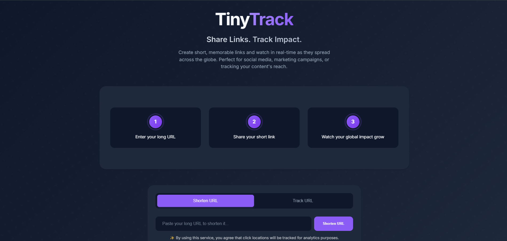

<div align="center">

# TinyTrack 🌍

### Modern URL Shortener with Real-Time Analytics

[](https://tinyurl-tracker.vercel.app/)
[](https://tinyurl-tracker.vercel.app/)
[](https://tinyurl-tracker.vercel.app/)

Create short links and watch your content spread across the globe in real-time with an interactive heatmap.

[](https://tinyurl-tracker.vercel.app/)

</div>




> 💡 *Screenshot shows the interactive world map and click tracking features*

<div align="center">

## ✨ Features

`🔗 URL Shortening` `📊 Real-time Analytics` `🌐 Global Visualization` `🗺️ Click Heatmaps` `🎨 Modern UI`

</div>

---

- **URL Shortening**: Convert long URLs into concise, shareable links
- **Real-time Analytics**: Track clicks as they happen
- **Global Visualization**: Interactive world map showing your link's reach
- **Click Heatmaps**: See where your content is most popular
- **Modern UI**: Clean, responsive design with smooth animations

<div align="center">

## 🚀 Try It Out

</div>

1. Visit the [Live Demo](https://tinyurl-tracker.vercel.app/)
2. Paste any long URL
3. Share your shortened link
4. Watch as clicks appear on the world map!

<div align="center">

## 🛠️ Implementation Guide

</div>

<details>
<summary>Click to expand</summary>

### Quick Start Guide

Want to use this code? Here's how to get started:

1. **Clone the Repository**
   ```bash
   git clone https://github.com/DionOwenJones/tinyurl-tracker.git
   cd tinyurl-tracker
   ```

2. **Set Up Supabase**
   - Create a free account at [Supabase](https://supabase.com)
   - Create a new project
   - Go to SQL Editor
   - Copy and paste the schema from `supabase/schema.sql`
   - Execute the SQL to create your tables
   - Go to Project Settings > API to get your:
     - Project URL
     - Anon Public Key

3. **Set Up Google Maps**
   - Go to [Google Cloud Console](https://console.cloud.google.com)
   - Create a new project
   - Enable Maps JavaScript API
   - Create API credentials
   - Restrict the API key to your domain

4. **Configure Environment**
   Create a `.env` file:
   ```env
   SUPABASE_URL=your_project_url
   SUPABASE_ANON_KEY=your_anon_key
   GOOGLE_MAPS_API_KEY=your_maps_key
   ```

5. **Customize the Code**
   - `index.html`: Change title, description, and branding
   - `style.css`: Update colors and styling
   - `script.js`: Modify tracking parameters if needed

6. **Deploy**
   - Create a [Vercel](https://vercel.com) account
   - Install Vercel CLI: `npm i -g vercel`
   - Deploy: `vercel`
   - Add your environment variables in Vercel's project settings

### Security Notes
- Always restrict your API keys to your domain
- Set up proper CORS policies in Supabase
- Consider rate limiting for production use

### What's Included
- `index.html`: Main application interface
- `style.css`: Modern, responsive styling
- `script.js`: Core functionality
- `supabase/schema.sql`: Database structure

### Want to Build Your Own?
Here's what you'll need:

### Frontend
- HTML, CSS, and JavaScript
- Google Maps JavaScript API for visualization
- Modern UI framework of your choice

### Backend
- Database for storing URLs and click data
- API endpoints for:
  - URL shortening
  - Click tracking
  - Analytics retrieval
- Geolocation service for IP addresses

### Example Database Schema

```sql
-- URLs table
CREATE TABLE urls (
    id UUID PRIMARY KEY,
    original_url TEXT NOT NULL,
    short_code TEXT UNIQUE NOT NULL,
    created_at TIMESTAMP WITH TIME ZONE
);

-- Clicks table
CREATE TABLE clicks (
    id UUID PRIMARY KEY,
    short_code TEXT NOT NULL,
    ip_address TEXT,
    latitude DOUBLE PRECISION,
    longitude DOUBLE PRECISION,
    city TEXT,
    country TEXT,
    clicked_at TIMESTAMP WITH TIME ZONE
);
```

</details>

<div align="center">

### Tech Stack

[](https://supabase.com)
[](https://developers.google.com/maps)
[](https://developer.mozilla.org/en-US/docs/Web/JavaScript)

</div>

<div align="center">

## ❓ FAQ

</div>

**Q: Can I use this code in my project?**
A: Yes! Feel free to use this code as inspiration for your own implementation.

**Q: How can I deploy my own version?**
A: You can deploy to platforms like Vercel, Netlify, or GitHub Pages. Just remember to set up your own backend service.

**Q: What backend should I use?**
A: Any backend that can store data and handle API requests will work. This demo uses Supabase, but you could use Firebase, MongoDB, or your own server.

**Q: How does the geolocation work?**
A: The demo uses IP geolocation. You can implement this using services like MaxMind, ipapi.co, or similar services.

<div align="center">

## 💡 Inspiration

</div>

This project demonstrates how to:
- Create a modern, responsive UI
- Implement real-time analytics
- Visualize geographic data
- Handle URL shortening
- Track user interactions

Use it as a starting point to build your own unique URL shortener!

<div align="center">

## 📄 License

</div>

This project is licensed under the MIT License - see below for details:

```
MIT License

Copyright (c) 2025 Dion Owen Jones

Permission is hereby granted, free of charge, to any person obtaining a copy
of this software and associated documentation files (the "Software"), to deal
in the Software without restriction, including without limitation the rights
to use, copy, modify, merge, publish, distribute, sublicense, and/or sell
copies of the Software, and to permit persons to whom the Software is
furnished to do so, subject to the following conditions:

The above copyright notice and this permission notice shall be included in all
copies or substantial portions of the Software.

THE SOFTWARE IS PROVIDED "AS IS", WITHOUT WARRANTY OF ANY KIND, EXPRESS OR
IMPLIED, INCLUDING BUT NOT LIMITED TO THE WARRANTIES OF MERCHANTABILITY,
FITNESS FOR A PARTICULAR PURPOSE AND NONINFRINGEMENT. IN NO EVENT SHALL THE
AUTHORS OR COPYRIGHT HOLDERS BE LIABLE FOR ANY CLAIM, DAMAGES OR OTHER
LIABILITY, WHETHER IN AN ACTION OF CONTRACT, TORT OR OTHERWISE, ARISING FROM,
OUT OF OR IN CONNECTION WITH THE SOFTWARE OR THE USE OR OTHER DEALINGS IN THE
SOFTWARE.
```

## Contact 📧

Dion Owen Jones - [@dionowenjones](https://github.com/dionowenjones)

Project Link: [https://github.com/DionOwenJones/tinyurl-tracker](https://github.com/DionOwenJones/tinyurl-tracker)
